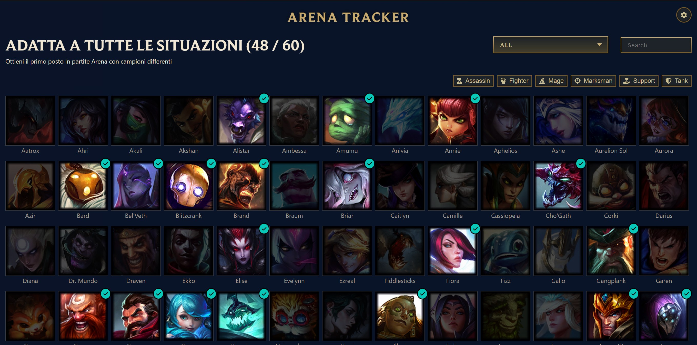
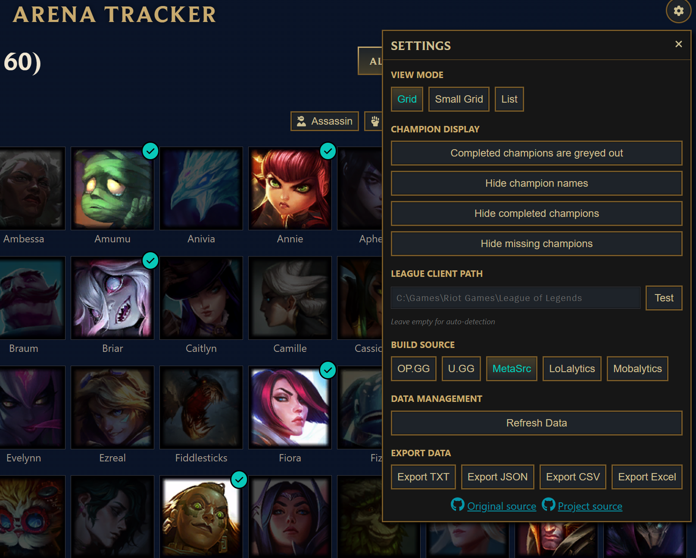

# LoL Arena Tracker

<div align="center">



[](https://github.com/Crimsab/lol-arena-tracker/releases/latest)
[](https://github.com/Crimsab/lol-arena-tracker/releases)
[](https://github.com/Crimsab/lol-arena-tracker/stargazers)
[](https://github.com/Crimsab/lol-arena-tracker/issues)
[](https://www.gnu.org/licenses/gpl-3.0)

**A specialized desktop application to track your Arena God challenge progress in League of Legends**

[](https://github.com/Crimsab/lol-arena-tracker/releases/latest)

</div>

---

## 📸 Screenshots

<div align="center">

| Main Interface | Settings Panel |
|:---:|:---:|
|  |  |

</div>

---

## ✨ Features

### 🎯 **Challenge Tracking**
- **Arena God Challenge**: Focus on the "ADAPT TO ALL SITUATIONS" challenge
- **Real-time Progress**: Automatically syncs with your League client
- **Completion Status**: Visual indicators for completed champions
- **Progress Counter**: Shows completed vs total champions (60 total)

### 🎨 **Multiple View Modes**
- **Grid View**: Large champion icons for easy browsing
- **Small Grid View**: Compact view with more champions visible
- **List View**: Detailed list with champion names and roles

### 🔗 **Build Source Integration**
- **OP.GG**
- **U.GG**
- **MetaSrc**
- **LoLalytics**
- **Mobalytics**

### 🔍 **Smart Filtering & Search**
- **Role Filtering**: Filter by Assassin, Fighter, Mage, Marksman, Support, Tank
- **Status Filtering**: Show All, Done, or Not Done champions
- **Search Function**: Find specific champions by name
- **Hide Options**: Hide completed or missing champions

### ⚙️ **Customization Options**
- **Champion Names**: Toggle champion name display
- **Color Coding**: Choose between colored completed or greyed out completed
- **Custom League Path**: Manual path configuration if auto-detection fails
- **Build Source Preference**: Choose your preferred build website

### 📊 **Data Management**
- **Export Functionality**: Export your progress in multiple formats
  - **TXT**: Human-readable text format
  - **JSON**: Structured data format
  - **CSV**: Spreadsheet-compatible format
  - **Excel**: Full Excel workbook with summary and champion sheets
- **Data Refresh**: Manual refresh button to update progress
- **Persistent Settings**: All preferences are saved automatically, even after quitting the application

### 🔌 **Technical Features**
- **Auto-Connection**: Automatically connects to League client
- **WebSocket Integration**: Real-time updates from League client
- **End-of-Game Detection**: Automatically refreshes after matches
- **Cross-Platform**: Built with Electron for Windows compatibility
- **Offline Support**: Works without internet for basic functionality

---

## 🚀 Quick Start

### 📥 Installation

#### **Option 1: Installer (Recommended)**
1. Download the latest installer from [releases](https://github.com/Crimsab/lol-arena-tracker/releases/latest)
2. Run the `.exe` file and follow the installation wizard
3. Launch from your desktop or start menu

#### **Option 2: Portable Version**
1. Download the portable version from [releases](https://github.com/Crimsab/lol-arena-tracker/releases/latest)
2. Extract the `.exe` file anywhere on your computer
3. Run directly - no installation required!

### 🎮 How to Use

1. **Launch League of Legends** client
2. **Start Arena Tracker** - it will automatically connect
3. **View Your Progress** - see which champions you've completed
4. **Click Champions** to open build guides on your preferred site
5. **Use Settings** (gear icon) to customize your experience
6. **Filter & Search** to find specific champions
7. **Export Data** to save your progress

---

## 🛠️ Development

### Prerequisites
- **Node.js** (v20 or higher)
- **npm** (v10 or higher)

### Setup
```bash
# Clone the repository
git clone https://github.com/Crimsab/lol-arena-tracker.git
cd lol-arena-tracker

# Install dependencies
npm install
```

### Development Commands
```bash
# Start development server
npm run dev

# Build for production
npm run build

# Build only installer
npm run build:installer

# Build only portable version
npm run build:portable
```

---

## 🏗️ Tech Stack

| Component | Technology |
|:---:|:---|
| **Frontend** | Vue 3 + TypeScript |
| **Desktop** | Electron |
| **Styling** | Custom CSS with League of Legends theming |
| **Data Source** | League Client API (LCU) |
| **Champion Data** | Riot Games API |
| **Build Sources** | External websites (OP.GG, U.GG, etc.) |

---

## 🔧 Troubleshooting

| Issue | Solution |
|:---|:---|
| **Connection Issues** | Use the custom League path setting if auto-detection fails |
| **No Data** | Ensure League of Legends client is running |
| **Export Problems** | Check file permissions in your download folder |

---

## 🤝 Contributing

Contributions are welcome! Feel free to submit a PR.

1. Fork the repository
2. Create your feature branch (`git checkout -b feature/Feature`)
3. Commit your changes (`git commit -m 'Add some Feature'`)
4. Push to the branch (`git push origin feature/Feature`)
5. Open a Pull Request

---

## 📄 License

This project is licensed under the GNU General Public License v3.0 - see the [LICENSE](LICENSE) file for details.

---

## 🙏 Credits

This project is based on the original [LoL Challenge Tracker](https://github.com/Nyquase/lol-challenge-tracker) by [Nyquase](https://github.com/Nyquase), modified specifically for Arena challenge tracking.

---

<div align="center">

**⭐ If you found this project helpful, give it a star! ⭐**

[](https://github.com/Crimsab)

</div>